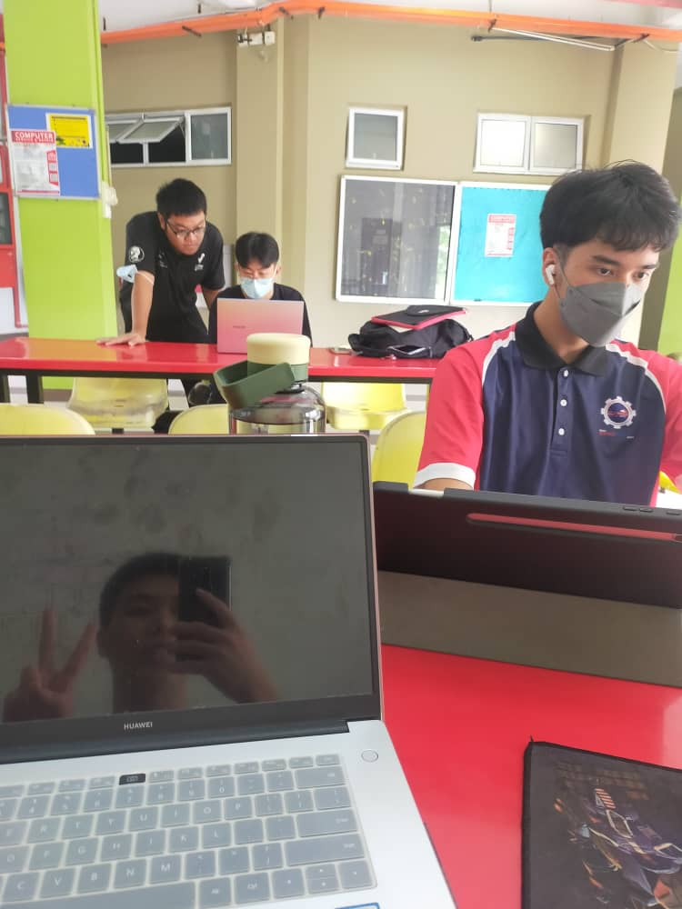

# Data engineering students

## About me (Profile section)
- name | Elijah She Yu Sheng
- Age | 19
- Hometown | [Miri,Sarawak](https://maps.app.goo.gl/NJ4rPcbrBez1TKh2A)
- Birthday | 13/04/2004
- Introduce myself | A stduent who is curious and eager to learn new things.
- Hobbies | Play and play 
- Ambition | Software Developer
- Skills | _C++,Cooking_
 

## **Education**
- Bachelor of _Data Science_ Year 1 Student  | The University of Technology Malaysia (_1st of October 2023_)								       		
- Matriculation Students, Computer Science	| Labuan Matriculation College(_July 2022_)	 	 			        		
- Secondary Students, Pure Sciences | SMK Chung Hua Miri (_January 2017_)

## **Work Experience**
### Sale Promoter 
>  Touch n'Go
> - _practices communicating skills with various language_
> - _Works closely with the team._

### **Cashier**
> Tiong Hee Auto Supply (Krokop)
> Syarikat Kai Nguong Nursery Sdn Bhd
> - _accounting skills have been increased. Organzation of files._
> - _good communicating with customer._

> WAITER
> Wan Xiang Noodle Shop, Roman Bakery, 123 Family Cafe
> - _serve food and beverage_
> - _know how to provide customer need_

## **Assignment**
### Assignment 1 (Career Development)

[Poster linkedin](https://www.linkedin.com/posts/esys-sheng-34a008299_throughout-this-talk-we-learn-about-the-activity-7126741162597478400-LE9Q?utm_source=share&utm_medium=member_desktop)

> Throughout this talk, we learn about the journey of a data engineer, from obtaining a bachelor's degree, entering the industry for internships, and becoming a full-fledged data engineer analyst. In the future, he or she will evolve into a data engineering specialist.

### Assignment 2 (Presentation Ch 7 & 8)
[presentation slide](https://drive.google.com/file/d/1xTrJZGQe1PjWYymB2eztPliefIQKypp_/view?usp=drive_link)

### *Discussion photo ~_~*

### Assignment 3 (Design Thinking)
>In design thinking, inventors create or modify applications, employing critical thinking to meet users' needs. The core principles are empathy, ideate, prototyping, and iteration adapt to solve complex problems, >ensuring effective, user-friendly solutions. There are many types of computer software, such as educational software, utility software, application software, enterprise software, programming software and system >software. However, our report mainly delves into educational software, emphasizing the importance of tailored solutions within this broader domain.

- [Data Science YouTube](https://www.youtube.com/channel/UCa9gErQ9AE5jT2DZLjXBIdA)

### Assignment 5 (Video on UTMDigital)

- [Data Science Blog](https://medium.com/@shawhin)
